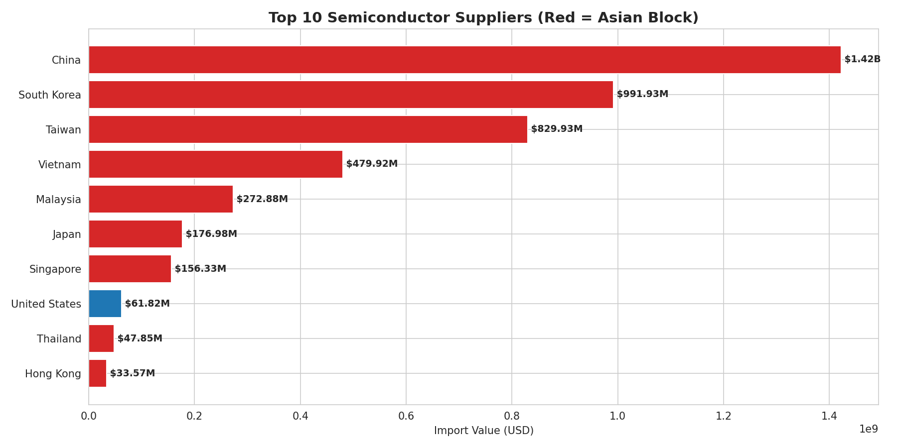
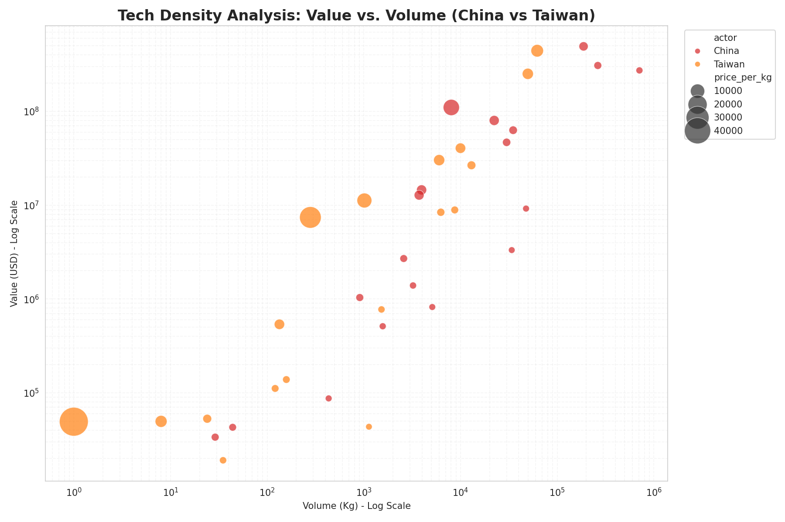
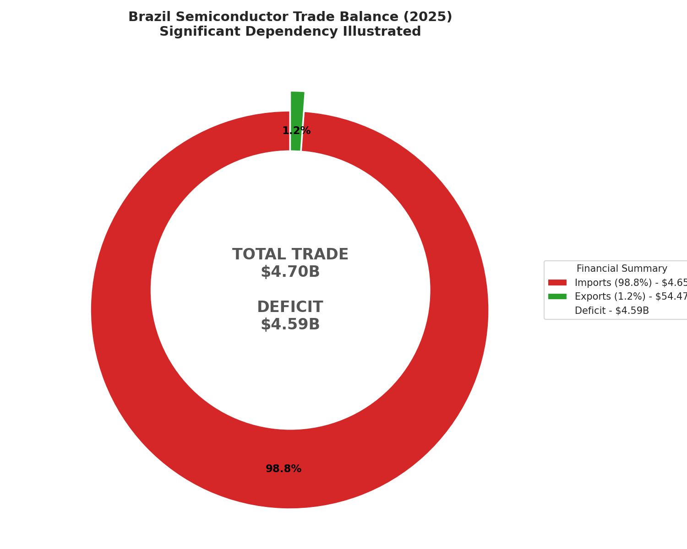

# 🇧🇷 Brazil's Semiconductor Supply Chain Vulnerability

> **Strategic Intelligence Analysis | Supply Chain Risk | Data Analysis | Python, Pandas & Seaborn**

## 📋 Executive Summary
This project quantifies Brazil's strategic vulnerability in the global semiconductor market. By analyzing 2025 trade data from Comex Stat, I identified a **critical dependency on the Asian geopolitical block**, exposing the national industry to severe supply chain disruptions in the event of regional conflicts, mainly in Taiwan Strait and South China Sea.

The goal was to move beyond raw data and provide **Risk Assessment** for stakeholders in the industrial and technology sectors.

---

## 🚀 Key Strategic Findings

Based on the quantitative analysis of import/export microdata (NCM), the following strategic risks were identified:

### 1. The "Asian Choke Point"
Brazil does not merely import chips; it relies on a single geopolitical theater.
* **92.3%** of all semiconductor imports originate from Asia.
* **Primary Risks:** Any blockade in the South China Sea or conflict involving Taiwan would essentially paralyze the Brazilian technology sector.

### 2. Massive Trade Deficit
The ratio between Import and Export demonstrates a lack of domestic sovereignty in high-tech manufacturing.
* **Imports:** $4.65 Billion (USD)
* **Exports:** $54.47 Million (USD)
* **Imbalance Ratio:** **85x** more imports than exports.

### 3. Top Tier Dependency
Three players control the flow of technology into Brazil:
1.  🇨🇳 **China:** 30.6% share
2.  🇰🇷 **South Korea:** 21.3% share
3.  🇹🇼 **Taiwan:** 17.8% share

---

## 📊 Data Visualization

### 🌍 1. The Dependency Map (Origin Share)
*Visualizing the dominance of the Asian Block in the Brazilian supply chain.*


### 📉 2. Top 10 Suppliers & Geopolitical Blocs
*Comparison of trade volume, highlighting the disparity between Asian and Western suppliers.*



### 💎 3. Value vs. Volume (Tech Density)
*Scatter plot analyzing the "Price per Kg". High value/low weight indicates advanced processors (Taiwan), while low value/high weight indicates commodities (China).*



### ⚖️ 4. Financial Impact
*The Trade Balance deficit highlights the lack of technological sovereignty.*



---

## 🛠 Methodology & Tech Stack

The analysis followed a rigorous data engineering pipeline to ensure accuracy in financial reporting.

* **Language:** Python 3.10+
* **Data Manipulation:** `Pandas` (ETL, GroupBy aggregations, currency cleaning).
* **Visualization:** `Matplotlib` & `Seaborn` (Custom formatting for financial KPIs).
* **Data Governance:** Implementation of dynamic formatting functions (Billions/Millions) to ensure readability for decision-makers.

```python
# Snippet: Dynamic Financial Formatting Logic used in the project
def format_value(value_in_millions):
    if value_in_millions >= 1000:
        return f'${value_in_millions / 1000:.2f}B'
    else:
        return f'${value_in_millions:.2f}M'
